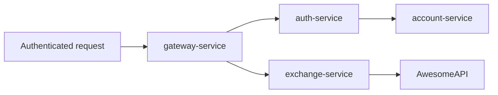
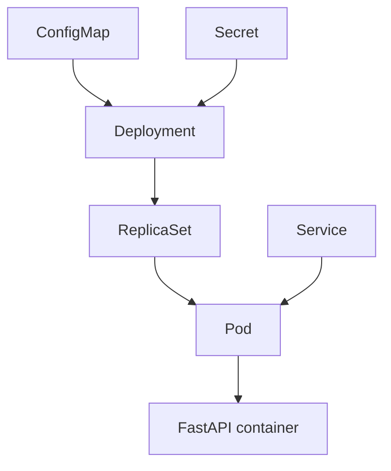

# projeto-exchange.exchange-service

Microservico Python/FastAPI responsavel por consultar taxas de cambio em uma API externa e devolver a cotacao ao usuario autenticado.

## Requisito Atendido

O enunciado pede uma API em Python que exponha:

```http
GET /exchanges/{from}/{to}
```

A API deve:

- usar um servico de terceiros para buscar cotacoes;
- exigir usuario autenticado;
- retornar `sell`, `buy`, `date` e `id-account`;
- rodar como microservico integrado ao projeto principal.

## Arquitetura



O `exchange-service` nao valida JWT diretamente. Ele segue a mesma logica do repositorio base: o `gateway-service` valida o cookie JWT, resolve o usuario no `auth-service` e injeta o header `id-account`.

## Endpoints

| Metodo | Caminho | Autenticacao | Descricao |
|---|---|---|---|
| `GET` | `/exchanges/{from}/{to}` | Sim | Retorna cotacao entre duas moedas |
| `GET` | `/health-check` | Interna | Verificacao simples de saude |
| `GET` | `/info` | Interna | Informacoes basicas do servico |
| `GET` | `/metrics` | Interna | Metricas Prometheus |

## Contrato

Requisicao:

```http
GET /exchanges/USD/BRL
id-account: 0195ae95-5be7-7dd3-b35d-7a7d87c404fb
```

Resposta:

```json
{
  "sell": 5.71,
  "buy": 5.70,
  "date": "2026-05-09 14:23:42",
  "id-account": "0195ae95-5be7-7dd3-b35d-7a7d87c404fb"
}
```

## Provedor Externo

O servico usa a AwesomeAPI por padrao:

```text
https://economia.awesomeapi.com.br/json/last/{from_currency}-{to_currency}
```

Exemplo:

```text
https://economia.awesomeapi.com.br/json/last/USD-BRL
```

## Bottlenecks

| Bottleneck | Implementacao |
|---|---|
| Caching | Cache em memoria por par de moedas, controlado por `EXCHANGE_CACHE_TTL_SECONDS` |
| Observability | Integracao com Prometheus via `/metrics` usando `prometheus-fastapi-instrumentator` |

## Variaveis de Ambiente

| Variavel | Padrao | Descricao |
|---|---|---|
| `EXCHANGE_PROVIDER_URL` | AwesomeAPI | Template da URL do provedor |
| `EXCHANGE_CACHE_TTL_SECONDS` | `60` | Tempo de vida do cache |
| `EXCHANGE_REQUEST_TIMEOUT_SECONDS` | `5` | Timeout das chamadas HTTP externas |

## Rodando Localmente

Com Python:

```bash
pip install -r requirements.txt
uvicorn main:app --host 0.0.0.0 --port 8080 --app-dir app
```

Com Docker Compose, a partir da pasta `api/` do repositorio principal:

```bash
docker compose up -d --build
```

## Testes Manuais

Sem passar pelo Gateway, para testar apenas o servico:

```bash
curl -i http://localhost:8080/health-check
```

No fluxo completo, o teste deve passar pelo Gateway:

```bash
curl -i -b cookies.txt http://localhost:8080/exchanges/USD/BRL
```

Sem cookie valido, o Gateway deve responder `401 Unauthorized`.

## Kubernetes

Arquivo:

```text
k8s/k8s.yaml
```

Recursos:

- `ConfigMap`: configuracoes do provedor, cache e timeout;
- `Secret`: espaco reservado para token de provedor, caso seja necessario;
- `Deployment`: executa o container FastAPI;
- `Service`: expoe o servico dentro do cluster.



## CI/CD

O `Jenkinsfile` possui:

- Dependencies: cria ambiente Python e instala dependencias;
- Build: compila os arquivos Python;
- Build & Push Image: gera imagem Docker multi-arch e publica no Docker Hub;
- Deploy to K8s: aplica `k8s/k8s.yaml`.

## Decisoes de Implementacao

- O servico escuta na porta `8080`, igual aos servicos Spring da base.
- A rota publica e definida no `gateway-service`, nao no proprio Exchange.
- O nome do header recebido e `id-account`, seguindo o padrao do gateway.
- O cache e local e simples, suficiente para demonstrar mitigacao de bottleneck sem adicionar Redis.
